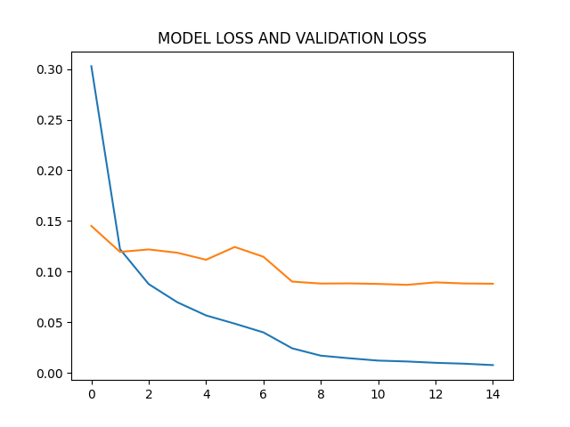
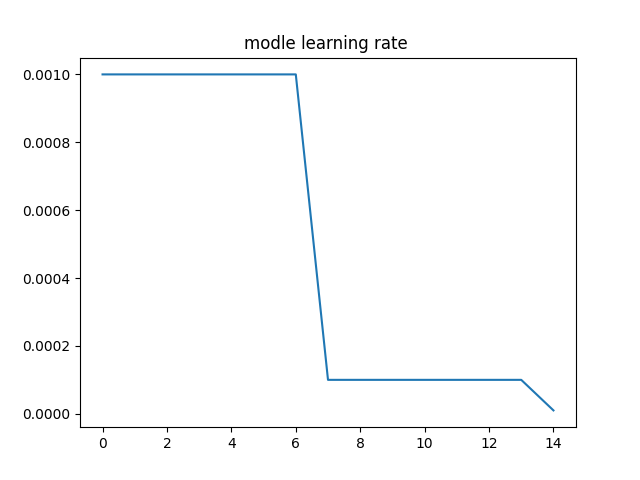
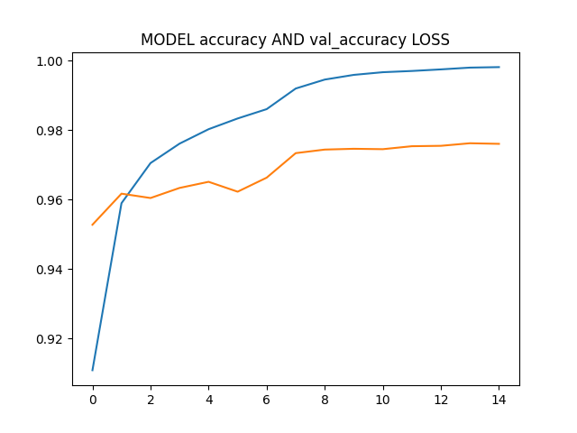
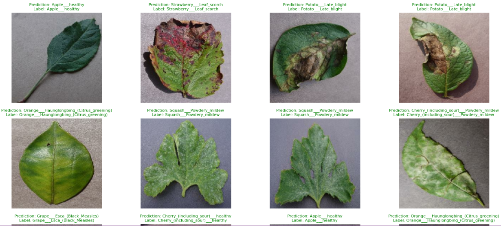

# Plant Diseases Prediction :
## Description : 
This project focuses on the classification of images depicting plant diseases with an accuracy of 96%. We utilize a convolutional neural network (ConvNet) architecture and the MOBILENET pre-trained model for this task
## Dataset : 
We employ the Kaggle New Plant Diseases Dataset, which can be accessed through the following [link](https://www.kaggle.com/datasets/vipoooool/new-plant-diseases-dataset)
## Model Archi : 

## results : 
### model loss

### learning rate during training

### model accuracy 

### some predections

## tools  : 
1-[tensorflow](https://www.tensorflow.org/) :  TensorFlow is utilized as the deep learning library for implementing the ConvNet architecture.
2-[MOBILENET](https://www.tensorflow.org/api_docs/python/tf/keras/applications/MOBILENET) : We leverage the VGG16 pre-trained model, which is known for its effectiveness in image classification tasks.
3- [Pandas](https://pandas.pydata.org/) :  Pandas is employed as a tool for data analysis and manipulation.

## Cloning the Project:
To clone the project, execute the following commands in your terminal
```bash

git clone <repository_directory> 
cd <repository_directory>
code .

```
# Additional Information: 
## Data Preprocessing:
 Prior to training, the dataset undergoes preprocessing steps such as resizing(224,224), normalization, and augmentation to enhance model performance.
## Model Fine-Tuning:
 Although VGG16 is a pre-trained model, we fine-tune it on our specific dataset to adapt it to the plant disease classification task.(38 classe instead of 1000 class)
## Evaluation Metrics: 
In addition to accuracy, other evaluation metrics such as [Accuracy](https://keras.io/api/metrics/accuracy_metrics/) , [CategoricalCrossentropy](https://www.tensorflow.org/api_docs/python/tf/keras/metrics/CategoricalCrossentropy) are calculated to provide a comprehensive assessment of model performance.
## Deployment: 
After training and evaluation, the model can be deployed in real-world applications, such as mobile or web applications, to assist farmers in identifying and managing plant diseases effectively.